LB3 - IoTKit - Azure Cloud - PowerPI
====================================

Die nachfolgende Dokumentation basiert auf einer Projektarbeit für das Modul 242 an der Technischen Berufsschule Zürich, von Luca Kiefer, Haris Chandrakumar und Cedric Kupper.

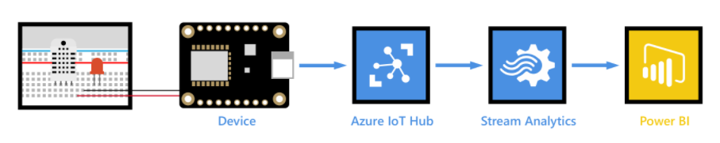 

IoTKit 
------ 

* MBED Studio installieren, DOWNLOAD LINK: https://os.mbed.com/studio/
* Das IoT Kit angeschlossen und das [Cloud Programm](https://github.com/iotkitv3/cloud) importiert. 

* Auf "File" klicken und "Import Programm" wählen                                                                                                                                    
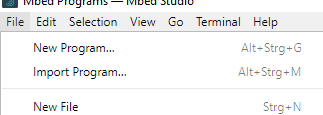                                                                                                                                    

* Die Git-Hub URL des "Cloud" Dienstes einfügen und einen Namen vergeben, dann importieren                                                                                                                                    
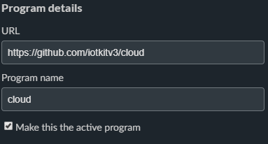                                                                                                                                    

* Um das IoT Kit anzuhängen, unter "Target", rechts unten auf das blaue Icon klicken                                                                                                                                                
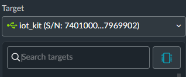                                                                                                                                                

* Dann bei "USB-Device" das Kit auswählen das Build Target überprüfen, wenn alles stimmt, auf "Save All" klicken                                                                                                                                                
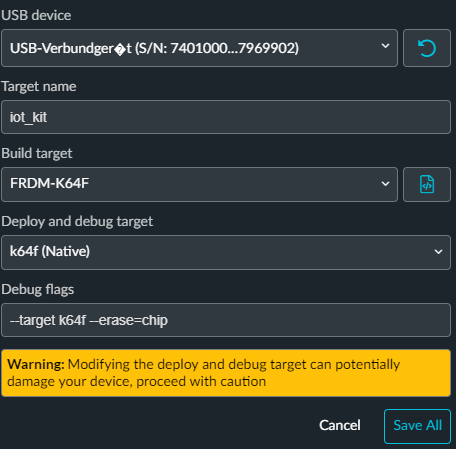                                                                                                                                                

* Nun ist das IoT Kit unter "Targets" mitt dem vorhin vergebenen Namen gespeichert. Wählt es aus                                                                                                                                                
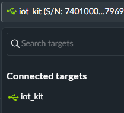   


Azure Cloud
-----------

* IoT Hub erstellt:
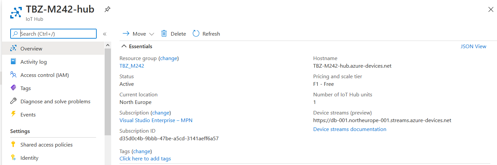

* In IoT Hub ein Device erstellt
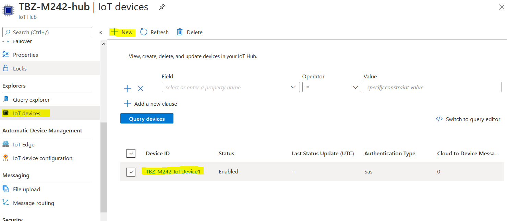

* "Primary Connection String" kopiert und in [mbed_app.json](link) kopiert 
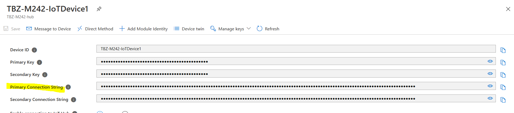

### Beispiel Programm abändern 

* Das .json file anpassen, doppelklick und warten bis es sich öffnet
                                                                                                                                                
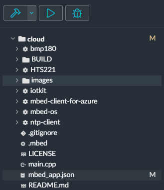                                                                                                                                                

* Nun die eigenschaften und den AZURE Link einfügen      
                                                                                                                                          
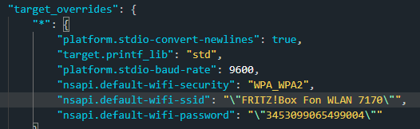                                                                                                                                                
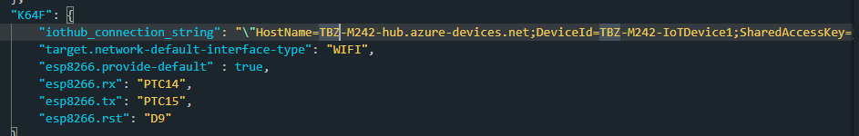                                                                                                                                                

* Zum schluss auf das "Play" Icon klicken und warten bis das Programm fertig Installiert wurde           
                                                                                                                                     
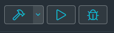                                                                                                                                                


### Beispiel Programm erweitert, z.B. mehr Sensordaten senden oder andere Daten.

* Das gerät Sendet die Temperatur Daten an AZURE
                                                                                                                                                
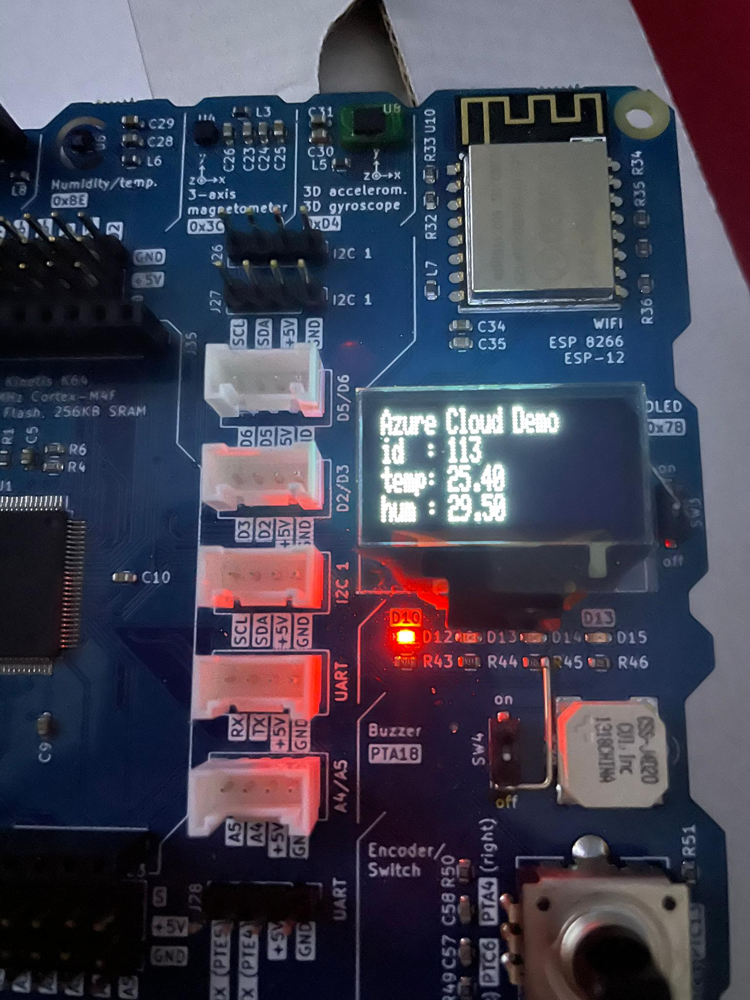   

Um zu Testen ob die Daten ankommen bitte mit Azure CLI folgende Befehle ausführen:

```
az login
az extension add --name azure-iot
az iot hub monitor-events --hub-name <IoT Hub Name> --props all
```

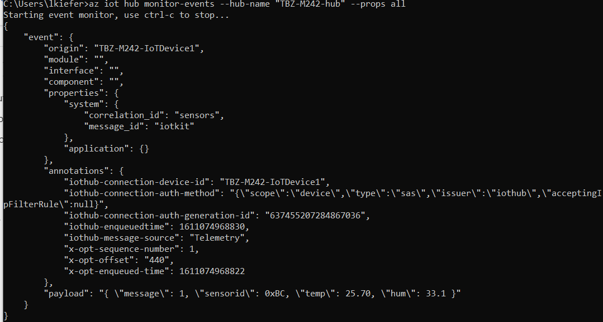  

### Auswertung der Daten in PowerBI

* Consumer Gruppe zu IoT hub hinzufügen
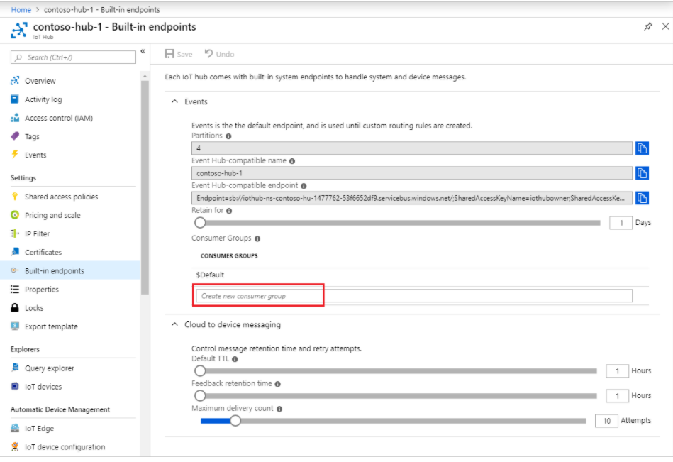 

* Stream Analytics Job erstellen
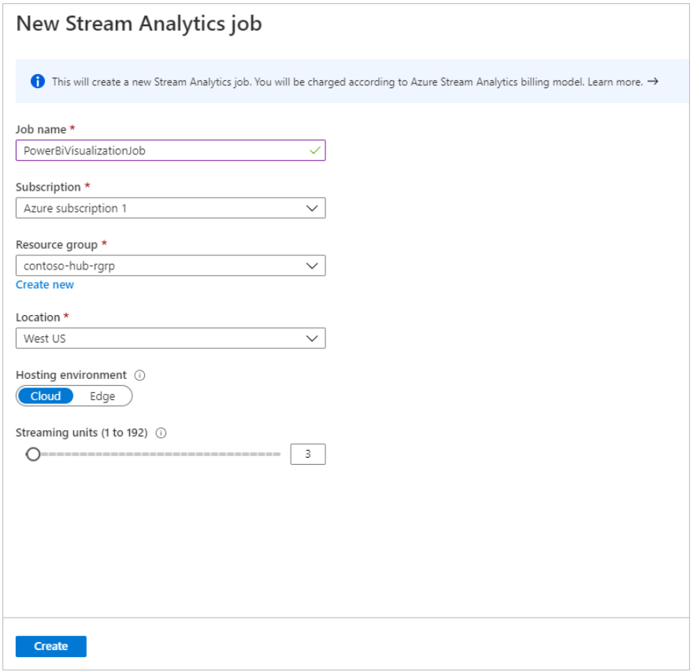  

* Input und Output zum Stream Analytics Job hinzufügen
-> verlinkung mit IoT Hub
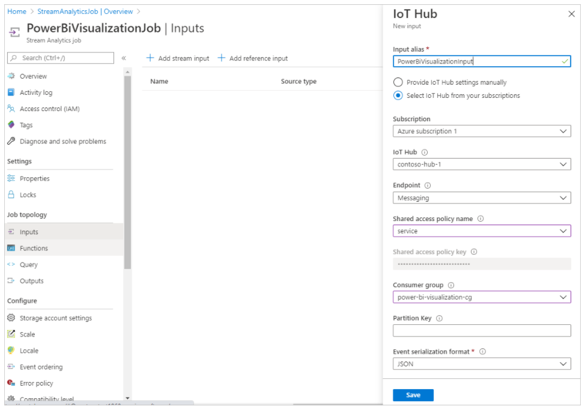  
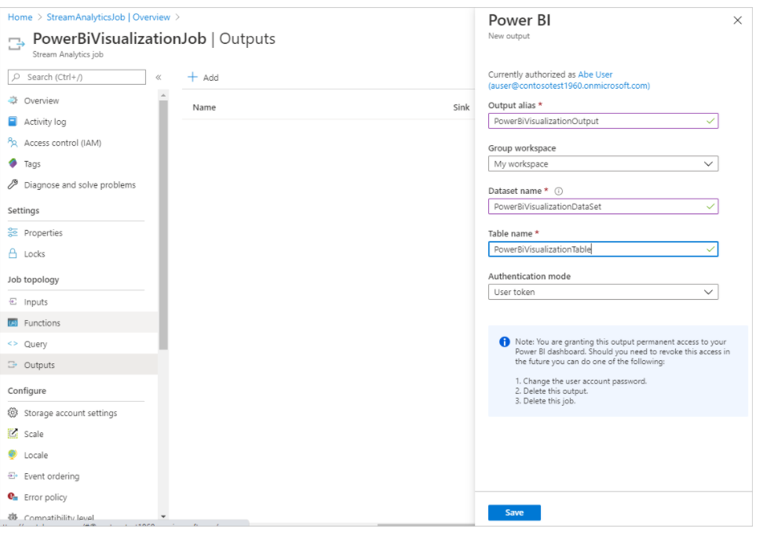 

* Query anpassen
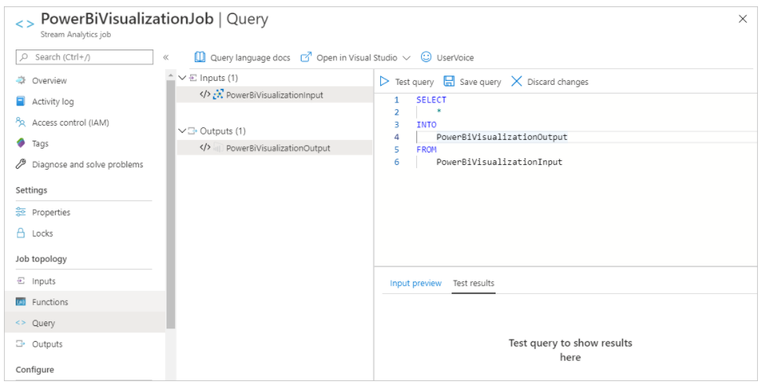  

* -> Start des Jobs

* In PowerBi Daten erfassen
* -> Report erstellen (Gelb markiert beachten)

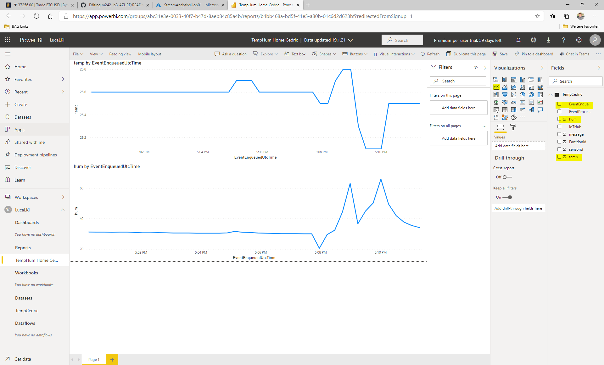  

### Ergebniss

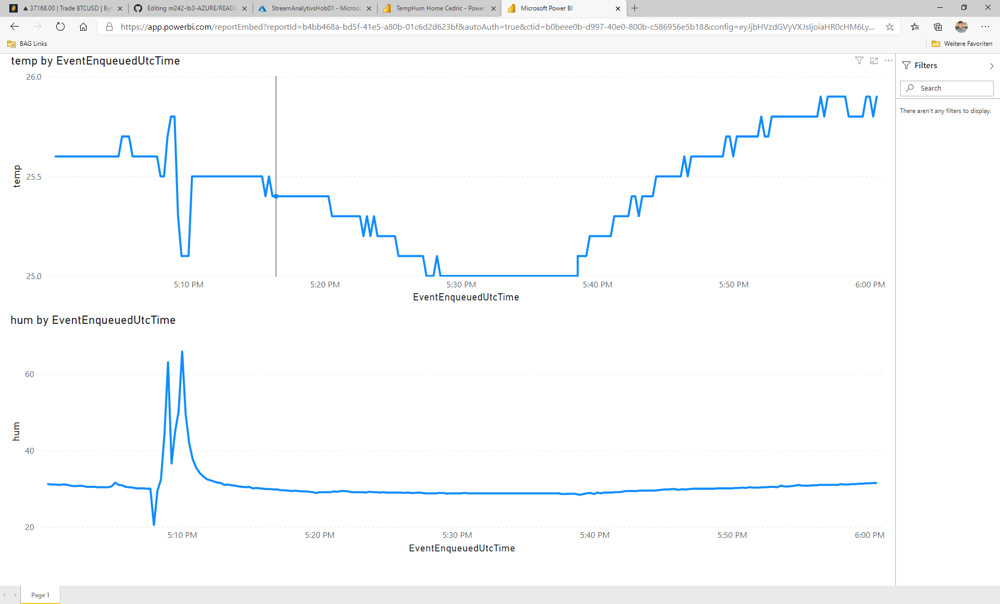  


